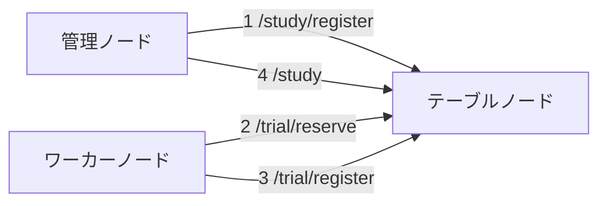

# lite_dist2
Simple distributed computing system

## 1. 概要
LiteDist2 は簡易的な分散処理システムです。後述する３種類のノードを使用して処理を行います。

## 2. アーキテクチャ
### 管理ノード（Management Node）
`Study` の登録や結果の取得を行います。この動作は `TableNodeClient` に実装されているのでそれを使用してもいいですし 、
curl や talend などのAPIツールを使用することもできます（[API リファレンス](#7-api-リファレンス)を参照してください）。

### テーブルノード（Table Node）
`Study` を細切れにした `Trial` や `Study` をまとめた `Curriculum` を管理するノードです。`Trial` の提案とその結果の集約を行います。
このノードの台数は常に1台にしてください。このノードは実際に行われる計算タスクの実装を知る必要はありません。
従って、直接このリポジトリをクローンしてサーバを起動しても事足りますが、管理上はワーカーノードと揃えた方が望ましいでしょう。

### ワーカーノード（Worker Node）
テーブルノードから取得した `Trial` を実行し、結果をテーブルノードに返却します。
このノードは分散処理する関数を実装してある必要があります。
多くの場合、このライブラリを利用したプロジェクトのリポジトリが展開（クローンや Docker イメージの展開など）されているはずです。

### ノード間の通信
上記のノードは以下のように連携して動作します。

数字は典型的な使い方でのAPIアクセスの順番を表しています。
1. 管理ノードがテーブルノードに `Study` を登録する（/study/register）
2. ワーカーノードがその `Study` から生成される `Trial` を取得（/trial/reserve）して、実行する
3. ワーカーノードが完了した `Trial` をテーブルノードに登録する（/trial/register）
4. 2~3を終了するまで繰り返したら、最後に結果を取得する（/study）

## 3. 主要概念
LiteDist2 を説明するさいにはいくつかの用語が必要です。既に出てきた `Study`、`Trial` がそれです。

### Study
ワーカーノードを使って処理する大きなタスクのことです。
必ず１次元以上のパラメータ空間を持ち、その空間内のグリッドの座標がワーカーノードに与えられ、所定の計算を行います。
１つのテーブルノードで、複数種類の計算を実行させることも可能で、その場合は `Study` に `required_capacity: set[str]` を設定します。
ワーカノードも同様に自分が実行できる計算の種類を `retaining_capacity: set[str]` として宣言することができ、
これにより各ノードの能力に応じたタスクを実行させることができます。

### Trial
`Study` を分割したタスクの一部です。１つの `Trial` は必ず１つのワーカーノードで実行されます。
ワーカーノードでは `TrialRunner` で実行された後、結果を追加してテーブルノードに送り返されます。
`Trial` のサイズは /trial/reserve で取得する際に送信する `max_size: int` で変更できます。

### ParameterSpace
ワーカーノードが計算する際の引数の組を生成する空間のことです。パラメータ空間は必ず１つ以上の次元を持ちます。
例えば、以下の例は３つの次元を持つ `ParameterSpace` の定義です。（数値の表し方については [PortableType](#portabletype) を参照）
```json
{
  "type": "aligned",
  "axes": [
    {"type": "bool", "name": "x", "size": "0x2", "step": "0x1", "start": false},
    {"type": "int", "name": "y", "size": "0x65", "step": "0x1", "start": "-0x32"},
    {"type": "float", "name": "y", "size": "0xc8", "step": "0x1.0p-2", "start": "0x0p+0"}
  ]
}
```
これは「x は ブール値の True か False、 y は整数の -50 から 50 まで 1 刻み、z は浮動小数の 0.0 から 50.0 まで 0.25 刻み」を意味します。
この場合、パラメータ空間では 2\*101\*200 = 40400 個のグリッドがあることになります。
具体的な `ParameterSpace` の実装については [ParameterSpace の実装について](#parameterspace-の実装について) を参照してください。

### PortableType
上記のように JSON 内で利用できる数値は文字列かブール値のみ許可されています。つまり、ブール値はそのまま利用できますが、整数値はhex表記しなければなりません。
これは異なる処理系を間に挟んでも、値が正確に表せるようにするためです。  
通常の型とこれらの `PortableType` への相互変換には以下の関数が利用できます。
```python
from lite_dist2.common import numerize, portablize
n = 0.24
p = portablize("float", n)  # "0x1.eb851eb851eb8p-3"
assert n == numerize("float", p)
```

### StudyStrategy
分散処理の種別によって処理の終了条件や必要な結果の取得方法が変わったりします。
用途に適した運用ができるように LiteDist2 では以下の3つの `StudyStrategy` を用意しています。
- `all_calculation`: 与えられたパラメータ空間全体にわたって所定の計算を行う。
- `find_exact`: ある関数の値が特定の値になるようなパラメータの組を探す。（ハッシュ関数の原像生成など）
- `minimize`: **未実装**。ある関数の値が最小になるようなパラメータの組を探す。（機械学習のハイパーパラメータチューニングなど）

`all_calculation` の例は次の通りです。`all_calculation` では必要なパラメータはありません。
```json
{
  "type": "all_calculation",
  "study_strategy_param": null
}
```
`find_exact` の例は次の通りです。こちらの例ではパラメータとして目標となる値、 `target_value` が必要です。
```json
{
  "type": "find_exact",
  "study_strategy_param": {"target_value": "aff97160474a056e838c1f721af01edf"}
}
```

### SuggestStrategy
それぞれのワーカーノードに対して `Trial` としてどの部分空間を割り当てるかは一意には定まりません。
これを司るのが `SuggestStrategy` です。現在、以下の２種類が用意されています。
- `sequential`: パラメータ空間の最初から順番に割り当てる。
- `random`: **未実装**。パラメータ空間内をランダムに選んで割り当てる。

`sequential` 例は次の通りです。`strict_aligned: true` を指定することで [`ParameterAlignedSpace`](#parameteralignedspace) の使用を強制できます。
```json
{
  "type": "sequential",
  "suggest_strategy_param": {"strict_aligned":  true}
}
```

### TrialRunner
ワーカーノードで `Trial` を実行するクラスのことです。このクラスは利用者が望む処理を実行するようにカスタマイズする必要があります。
具体的には `BaseTrialRunner` を実装する必要があります。`example/generate_mandelbrot_set.py` では次のように実装しています。

```python
from lite_dist2.type_definitions import RawParamType, RawResultType
from lite_dist2.worker_node.trial_runner import AutoMPTrialRunner


class Mandelbrot(AutoMPTrialRunner):
    _ABS_THRESHOLD = 2.0
    _MAX_ITER = 255

    def func(self, parameters: RawParamType) -> RawResultType:
        x = float(parameters[0])
        y = float(parameters[1])
        c = complex(x, y)
        z = complex(0, 0)
        iter_count = 0
        while abs(z) <= self._ABS_THRESHOLD and iter_count < self._MAX_ITER:
            z = z ** 2 + c
            iter_count += 1
        return iter_count
```
ここでは `BaseTrialRunner` に手を加えて自動でマルチプロセス処理を行ってくれる `AutoMPTrialRunner` という抽象クラスを利用しています。
注目すべきポイントは `func` メソッドの引数と戻り値の型です。  
引数は `parameters: RawParamType` で、パラメータの組の `tuple` です（例えば `(-0.5, 1.4)` など）。
一方で戻り値は `RawResultType` となっています。これは計算された値です（例えば `15` など）。戻り値がベクトル量の場合は `(1.2, 4)` のような `tuple` を利用することが可能です。  
`BaseTrialRunner` の実装については `AutoMPTrialRunner` の他にも `SemiAutoMPTrialRunner`、`ManualMPTrialRunner` があります。
詳細は [高度な TrialRunner の実装](#高度な-trialrunner-の実装) を参照してください。

## 4. インストール方法
### 必要要件
- Python >= 3.13

### 推奨要件
- uv >= 0.7.0

### インストール手順
```commandline
uv add lite-dist2
```
あるいは
```commandline
pip install lite-dist2
```

## 5. 使用方法
### 基本的な使い方
### 管理ノードの設定と実行
### テーブルノードの設定と実行
### ワーカーノードの設定と実行

## 6. 設定
### 設定ファイル
### 設定パラメータ

## 7. API リファレンス

## 8. API のスキーマ

## 9. 高度な使用方法
### ParameterSpace の実装について
#### ParameterAlignedSpace
[ParameterSpace](#parameterspace)の例は最も簡単なパラメータ空間の表し方の例で、最初に `Study` を登録する時に使用できる型（`ParameterAlignedSpaceRegistry`）です。
テーブルノードとワーカノードの間でやり取りをする場合はもう少し追加で情報が必要になります。
これは、上の例では空間全体を表せばそれで十分ですが、テーブルノードとワーカノードの間でやり取りでは「全体（母空間）に対してどの部分か」を表す必要があるためです。  
次の例は母空間の一部を切り取った部分空間を表したものです。
```json
{
  "type": "aligned",
  "axes": [
    {
      "type": "bool",
      "name": "x",
      "size": "0x1",
      "step": "0x1",
      "start": false,
      "ambient_size": "0x2",
      "ambient_index": "0x0"
    },
    {
      "type": "int",
      "name": "y",
      "size": "0x1",
      "step": "0x1",
      "start": "-0x23",
      "ambient_size": "0x65",
      "ambient_index": "0xf"
    },
    {
      "type": "float",
      "name": "y",
      "size": "0xc8",
      "step": "0x1.0p-2",
      "start": "0x0p+0",
      "ambient_size": "0xc8",
      "ambient_index": "0x0"
    }
  ]
}
```
x, y のサイズが変わっていることに注目してください。それぞれ `size` が 1 になっています。z は変化がありません。一方で新たに `ambient_size`, `ambient_index` が追加されています。
これはそれぞれ、母空間のサイズ、`start`の値の母空間でのインデックス、を表しています。  
これら追加の値はワーカーノードでの計算が終了した後にテーブルノードで集計する際に必要な値です。ワーカーノードでは単に `size`, `size`, `start` を見ればよく、
この例では 「x=false, y=-35, z は 0.0 から 50.0 まで」の１次元空間を表していることが分かります。

#### ParameterJaggedSpace
`ParameterAlignedSpace` のような「ここからここまで」の表記では必ず四角で区切られた範囲（正確には「超直方体」）を表すことしかできません。
一方で、「この点とあの点」のように具体的に列挙した方が便利な場面があります。
```json
{
  "type": "jagged",
  "parameters": [
    ["0x4e", "0x1"], ["0x38", "0xa"]
  ],
  "ambient_index": [
    ["0x4e", "0x1"], ["0x38", "0xa"]
  ],
  "axes_info": [
    {
      "type": "int",
      "name": "x",
      "size": "0x1",
      "step": "0x1",
      "start": "0x0",
      "ambient_size": "0x64",
      "ambient_index": "0x0",
      "is_dummy": true
    },
    {
      "type": "int",
      "name": "y",
      "size": "0x1",
      "step": "0x1",
      "start": "0x0",
      "ambient_size": "0x64",
      "ambient_index": "0x0",
      "is_dummy": true
    }
  ]
}
```
`parameters` が実際のパラメータを表し、`ambient_index` がそのパラメータが母空間でどのインデックスであるかを表しています。  
ただし、名前や型に関する情報は依然として必要であるので `axes_info` が定義されています。
最後のフィールドに `"is_dummy": true` とあることからも分かる通り、このオブジェクトは `type`, `name`, `ambient_size` のみが有効な値です。

### 半直線の利用

### 高度な TrialRunner の実装

## 10. 開発
### 開発環境のセットアップ
```shell
uv sync --dev
```

### テスト実行方法
```shell
uv run pytest
```
